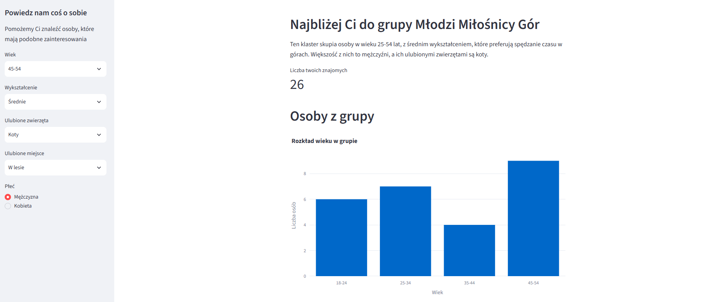
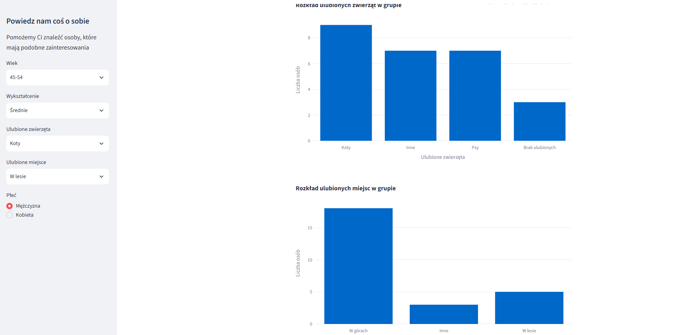

# **Find Friends – Inteligentny system dopasowywania użytkowników**

## O projekcie
Find Friends to aplikacja webowa typu "Data Science app", która pomaga użytkownikom znaleźć osoby o podobnych preferencjach. Wykorzystując algorytmy uczenia
maszynowego (klasteryzację), system przypisuje użytkownika do grupy opartej na jego danych oraz zainteresowaniach.

## Opis aplikacji
* **Wprowadzenie:** Aplikacja pozwalająca na profilowanie użytkowników i łączenie ich w grupy oparte na danych behawioralnych.
* **Problem:** Użytkownicy czują się zagubieni w dużych społecznościach. Trudno znaleźć osoby o podobnym stylu życia bez zaawansowanych narzędzi.
* **Rozwiązanie:** Stworzyłem narzędzie, które automatycznie segmentuje uczestników ankiety, pozwalając na szybkie dopasowanie ich do odpowiedniej grupy społecznej. Wykorzystałem model klasteryzacji K-Means wdrożony za pomocą biblioteki PyCaret, co pozwoliło na automatyczną segmentację bazy użytkowników.
* **Wdrożenie:** Aplikacja została wdrożona w chmurze Streamlit Community Cloud.

## Technologie
* **Język:** Python
* **Framework:** Streamlit
* **Uczenie maszynowe:** PyCaret
* **Biblioteki:** 
    * `Pandas` (przetwarzanie i analiza danych)
    * `Plotly` (wizualizacje danych)

---
> **Zobacz projekt:** [[Link do aplikacji na żywo](https://find-friends-boguslaw.streamlit.app/)] | [[Link do repozytorium GitHub](https://github.com/bodekb-prog/find_friends_zad_dom)]

---
### 🖼️ Wybrane zrzuty ekranu
* ustawione filtry, wizualizacja osób z grupy "Młodzi miłośmnicy Gór

* wizualizacje dotyczące wybranej grupy

---

