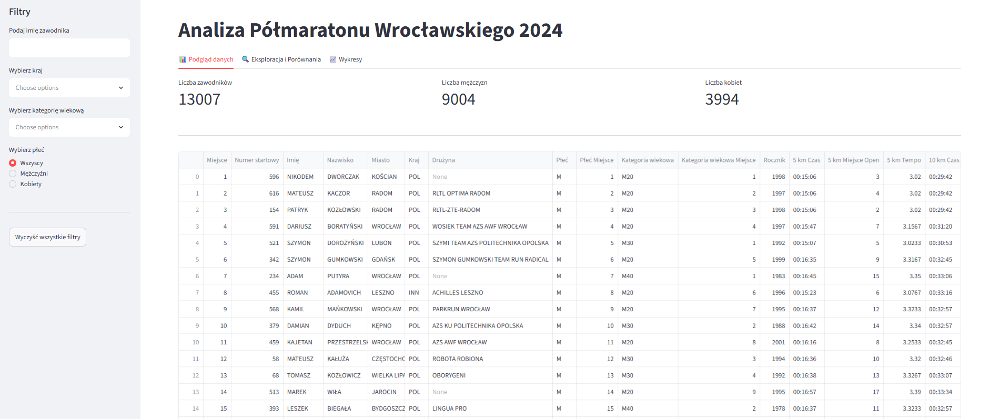
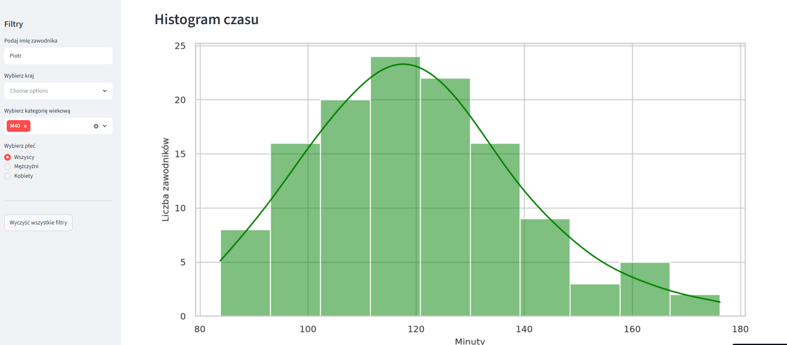

# Analiza wyników Półmaratonu Wrocławskiego 2024

## O projekcie
Interaktywna aplikacja webowa stworzona w celu analizy danych z Półmaratonu Wrocławskiego 2024. Narzędzie pozwala na szybką eksplorację wyników tysięcy zawodników poprzez dynamiczne filtrowanie danych oraz wizualizację statystyk.

## Funkcjonalności
* **Dynamiczne filtrowanie:** Możliwość wyszukiwania zawodników po imieniu, kraju pochodzenia, kategorii wiekowej oraz płci.
* **Statystyki podsumowujące:** Szybki wgląd w liczbę uczestników z podziałem na płeć przy użyciu czytelnych metryk.
* **Eksploracja danych:** Tabela podglądowa z losowymi rekordami oraz zestawienie TOP 5 zawodników w wybranej grupie.
* **Wizualizacje:**
    * **Wykres słupkowy:** Pokazujący rozkład narodowości uczestników.
    * **Histogram czasu na mecie:** Pozwalający ocenić tempo biegu i rozkład finiszujących zawodników.
    * **Macierz korelacji:** Analiza zależności między cechami numerycznymi zbioru danych.

## Technologie
* **Język:** Python
* **Framework:** Streamlit
* **Biblioteki:** * `Pandas` (przetwarzanie i analiza danych)
    * `Matplotlib` & `Seaborn` (wizualizacje danych)

---
> **Zobacz projekt:** [[Link do aplikacji na żywo](https://halfmarathonwroclaw2024.streamlit.app/)] | [[Link do repozytorium GitHub](https://github.com/bodekb-prog/halfmarathon_wroclaw_2024)]

---
### 🖼️ Wybrane zrzuty ekranu
* strona główna

* histogram czasu dla zawodników o imieniu Piotr i grupy wiekowej M40

---

